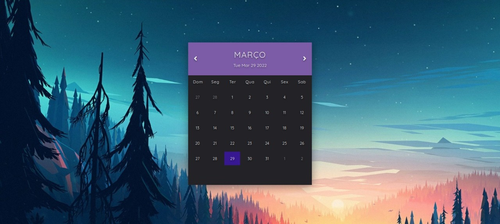

# Calendario
Para o desenvolvimento desse projetinho, foi utilizado logica em JavaScript, estilização em CSS e base em HTML, e tambem foi utilizado googleAPIs e Conteiners FlexBox. Abaixo é possivel observar um print do resultado.

Para o calendario, as datas sao fornecidas de forma dinamica, e sempre ira destacar o dia atual. Nas setas o usuario pode navegar pelos meses posteriores e anteriores do ano.

